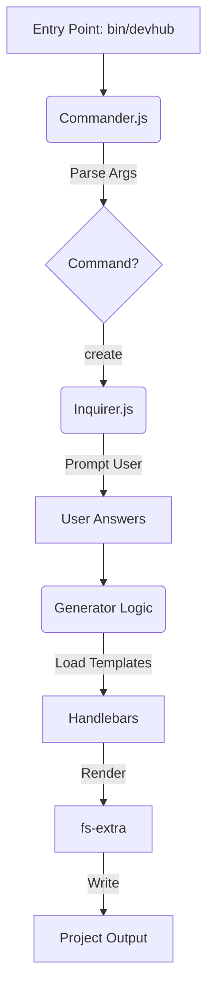

# DevHubTools Automator


> **Enterprise-ready boilerplates for Next.js, Node.js, and Python in under 60 seconds.**

The **DevHubTools Automator** is a CLI tool designed to standardize project setup, enforcing best practices, and significantly reducing the time required to scaffold new services.

##  Key Features

*   **Multi-stack Support**: Next.js (React), Node.js (Express), Python (Flask).
*   **Production Ready**: Includes `Dockerfile` and `ci.yml` (GitHub Actions) out of the box.
*   **Enforced Standards**: Pre-configured ESLint, Prettier (where applicable), and .gitignore.
*   **Interactive**: User-friendly prompts to customize your build.

##  Architecture

The tool is built on a robust Node.js foundation, leveraging industry-standard libraries to ensure reliability and maintainability.



The data flow follows this pipeline:
1.  **Entry Point** (`bin/devhub`): The executable that triggers the CLI.
2.  **Commander.js**: Parses command-line arguments (e.g., `create <app-name>`).
3.  **Inquirer.js**: Launches interactive prompts to gather user preferences (Project Type, Docker, CI).
4.  **Generator Logic** (`src/generators`): merging user input with templates.
    *   **Handlebars**: Renders dynamic content (names, versions) into template files.
    *   **fs-extra**: Writes the processed files to the destination directory.

##  Usage

### Installation

```bash
git clone <repo-url>
cd devhubtools-automator
npm install
npm link # option to run globally as 'devhub'
```

### Creating a Project

```bash
npx devhub create my-new-service
```

Follow the interactive prompts:

1.  **Select Project Type**: `Node.js`, `Python`, or `Next.js`.
2.  **Configuration**: Choose to include Docker or CI/CD workflows.

The tool will scaffold the directory structure, install dependencies (if applicable), and initialize the git repository.

##  Test Results & Verification

We rigidly test the generator against all supported stacks. Below are the results from the latest verification run:

```text
Starting comprehensive verification...

Testing Node.js generation...
✓ Node.js generated successfully.
  ✓ package.json found
  ✓ src/index.js found
  ✓ Dockerfile found
  ✓ CI workflow found

Testing Python generation...
✓ Python generated successfully.
  ✓ requirements.txt found
  ✓ app.py found
  ✓ Dockerfile found
  ✓ CI workflow found

Testing Next.js generation...
✓ Next.js generated successfully.
  ✓ Dockerfile found
  ✓ CI workflow found
```

*Tested on macOS / Node v18+*

##  Directory Structure

```
devhubtools-automator/
├── bin/            # Executable entry point
├── src/
│   ├── commands/   # Command definitions (create, etc.)
│   ├── generators/ # Logic for file generation and templating
│   └── prompts/    # Inquirer question definitions
├── templates/      # Blueprint files used by generators
│   ├── common/     # Shared files (Dockerfile, README, CI)
│   ├── nextjs/     # Next.js specific templates
│   ├── node/       # Node.js specific templates
│   └── python/     # Python specific templates
└── test/           # Verification scripts
```
