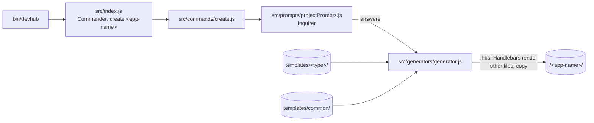
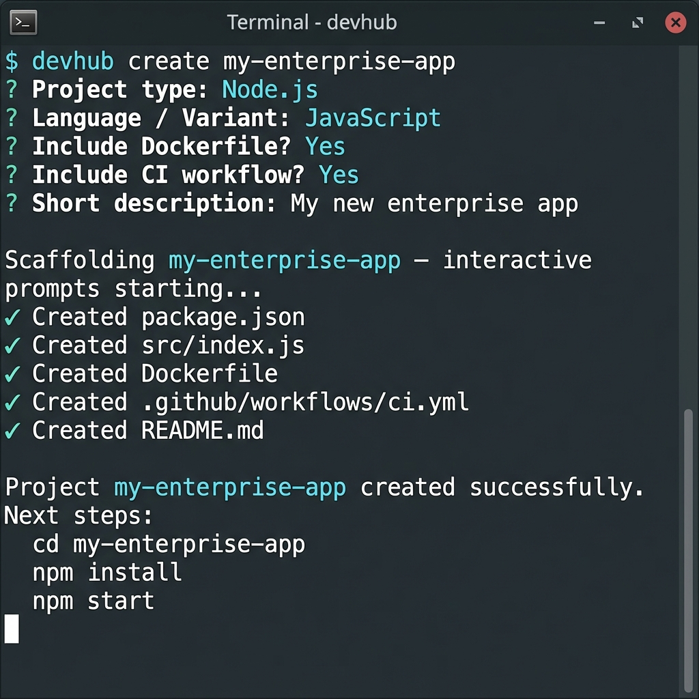

# DevHubTools Automator

A small Node.js CLI that scaffolds a starter project for Next.js, an Express API or a Flask app from one command and
five prompts.

<!-- demo video: TBD -->

## What it is and why

Starting a new service usually means copying an old project, deleting half of it and renaming things. `devhub create
<app-name>` replaces that with a few questions and a clean starting folder: a package or requirements file, a minimal
app, a Dockerfile, a CI workflow file and a README with the right commands for the stack.

It is a prototype, built in December 2025. It runs entirely on your machine: no network calls, no accounts, no
environment variables.

## Features

- **Three stacks**
  - **Next.js:** Pages Router with one page; `next`, `react` and `react-dom` set to `latest`.
  - **Node.js API:** Express 4 with helmet, cors, morgan and dotenv, plus `GET /` and `GET /health`; nodemon for
    `npm run dev`.
  - **Python:** Flask 3.0 with python-dotenv, plus `/` and `/health`; gunicorn listed in `requirements.txt`.
- **Interactive prompts** (Inquirer): project type, language variant, Dockerfile, CI workflow and a short
  description. Pressing Enter through every prompt gives a Next.js project.
- **Stack-aware shared files** (Handlebars conditionals): a Dockerfile (`python:3.9-slim` or `node:18-alpine`), a
  GitHub Actions-style `ci.yml`, and a README with install and run commands.
- **`.gitignore`** for the Node.js and Python templates.

## Known limitations

These are open in the current code:

- The Dockerfile and CI answers are not read yet: `Dockerfile` and `ci.yml` are always written.
- The `js` / `ts` choice is not read yet: every template is JavaScript.
- `ci.yml` is written to the project root, not `.github/workflows/`, and its YAML indentation is broken, so move and
  fix it before relying on it. The Node job also uses `npm ci`, which needs a lockfile, and the Node template's
  `test` script exits with an error.
- The Next.js template has a `lint` script but no ESLint dependency or config, and no `.gitignore`.
- Files in an existing folder with the same name are overwritten without a warning.
- The CLI does not install dependencies or run `git init`; you do that after generation.
- `npm test` is a placeholder; there are no automated tests yet.

## Architecture


```mermaid
flowchart LR
  A["bin/devhub"] --> B["src/index.js<br/>Commander: create &lt;app-name&gt;"]
  B --> C["src/commands/create.js"]
  C --> D["src/prompts/projectPrompts.js<br/>Inquirer"]
  D -->|answers| E["src/generators/generator.js"]
  T1[("templates/&lt;type&gt;/")] --> E
  T2[("templates/common/")] --> E
  E -->|".hbs: Handlebars render<br/>other files: copy"| F[("./&lt;app-name&gt;/")]
```

1. **`bin/devhub`** is the executable; it loads `src/index.js`.
2. **Commander** parses `create <app-name>` (`src/index.js`).
3. **Inquirer** asks the questions (`src/prompts/projectPrompts.js`) and adds `name`, `isNext`, `isNode` and
   `isPython` to the answers.
4. **The generator** (`src/generators/generator.js`) copies `templates/<type>/` and then `templates/common/` into
   `./<app-name>`. Files ending in `.hbs` are rendered with Handlebars and lose the extension; other files are copied
   with fs-extra as they are.

## Quick start

Requirements: Node.js and npm. Checked on macOS with Node.js 20.20 and npm 11.17 (2026-10-01).

```bash
git clone https://github.com/avnishyadav25/devHubTools-automator.git
cd devHubTools-automator
npm install
```

Run it from the clone:

```bash
node bin/devhub create my-new-service
```

Or link it once to get a `devhub` command everywhere:

```bash
npm link
devhub create my-new-service
```

The package is not published on npm. Inside the clone, `npx devhub create my-new-service` also works, but anywhere
else `npx devhub` would download an unrelated package with the same name. The project is always created in the
current directory.

## Usage

```text
Usage: devhub [options] [command]

DevHubTools Automator CLI

Options:
  -V, --version      output the version number
  -h, --help         display help for command

Commands:
  create <app-name>  Scaffold a new project
  help [command]     display help for command
```

A real run (Node.js stack, all other answers left at their defaults):

```text
$ devhub create demo-node
Scaffolding demo-node — interactive prompts starting...
? Project type node
? Language / Variant js
? Include Dockerfile? Yes
? Include CI workflow? Yes
? Short description demo-node generated by DevHubTools
Project demo-node created successfully.
```

What each stack generates:

| Stack | Files |
|---|---|
| `nextjs` | `package.json`, `pages/index.js`, `Dockerfile`, `ci.yml`, `README.md` |
| `node` | `package.json`, `src/index.js`, `.gitignore`, `Dockerfile`, `ci.yml`, `README.md` |
| `python` | `requirements.txt`, `app.py`, `.gitignore`, `Dockerfile`, `ci.yml`, `README.md` |

Then install and run the generated project:

```bash
cd demo-node
npm install
npm start                       # Express on PORT (default 3000)
curl localhost:3000/health      # {"status":"ok","timestamp":"..."}
```

For the Python stack: `pip install -r requirements.txt`, then `python app.py` (PORT, default 5000). For Next.js:
`npm install`, then `npm run dev` or `npm run build`.

## Environment variables

The CLI reads none. The generated apps read:

- `PORT`: optional, the port the Express or Flask app listens on.
- A `.env` file, loaded through dotenv (Node.js) or python-dotenv (Python), for your own settings.

## Directory structure

```text
devHubTools-automator/
├── bin/devhub              # Executable entry point
├── src/
│   ├── index.js            # Commander program
│   ├── commands/create.js  # The create command
│   ├── generators/         # Template walking and rendering
│   └── prompts/            # Inquirer questions
├── templates/
│   ├── common/             # Dockerfile, README and ci.yml (Handlebars)
│   ├── nextjs/             # Next.js files
│   ├── node/               # Express API files
│   └── python/             # Flask files
├── assets/screenshot.png
└── test/run.js             # Placeholder test runner
```

## Screenshots



`assets/screenshot.png` is an illustration of the prompt flow, not a capture of the current output (the real output
is the transcript under Usage).

<!-- screenshot: real terminal capture TBD -->

## Tests

```bash
npm test
```

This currently prints "No tests configured — placeholder test runner." The checks above (help, one run per stack,
starting the generated Express and Flask apps, building the generated Next.js app) were done by hand on 2026-10-01.

## License

No license file yet. `package.json` declares MIT.

## Author

Built by [Avnish Yadav](https://avnishyadav.com).
